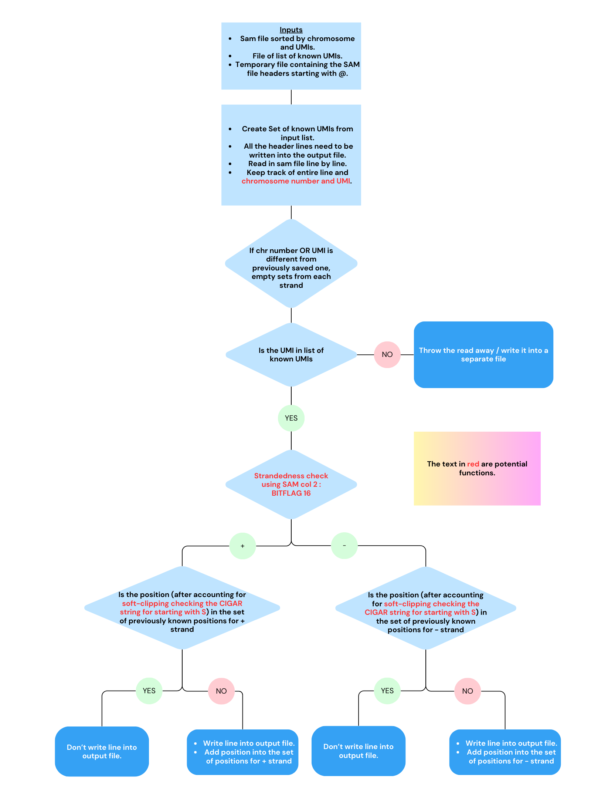

# **Pseudocode for Deduper** :rose: 

 A strategy for writing a Reference Based PCR Duplicate Removal tool.

 Given a sorted sam file of uniquely mapped reads, remove all PCR duplicates (retain only a single copy of each read). 
 
 A strategy that avoids loading everything into memory.

# **Problem**

Whet defines a PCR Duplicate:

- **Same alignment position** 

| Identifier | Description |
| --- | --- |
| Chromosome   | RNAME (SAM col 3)  |
| 5' start of read  | POS (SAM col 4) + CIGAR  starting with 'S' (SAM col 6)  |
| Strand | FLAG (SAM col 2 : BITFLAG 16) |
       
- **Same Unique Molecular Index**       
QNAME (SAM col 1)


PCR duplicates are identified by being present on the same position on the same strand of the same chromosome AND having the same UMI, which is an random index inserted during library prep. The UMI is a way to tell whether the read was actually a technical replicate or a biological one with more confidence. If the reads mapped to same positions but they do not have the same UMIs, they could be biological replicates and indicate actual increase in gene expression and should be kept as they are not PCR duplicates. 

These PCR duplicates are artefacts of random extra amplification of certain reads during library prep. Duplicates during alignment only increase coverage of particular regions and during mapping also doesn't have much of an effect. For downstream analyses they might cause problems while doing transcript abundance analysis while looking for genes with higher or lower expression. This is why its more important to remove it after aligning and mapping to gene positions. Removing them during alignment or mapping to genes could be very time and memory consuming as there would need to be 1-1 comparisions of millions of reads. Going through them after they are mapped to gene positions in SAM/BAM files is hence the best course of action.

Clipping can help improve the quality of alignments by focusing on the high-confidence, well-aligned portions of the reads and discarding or ignoring the low-quality or non-aligning parts. Soft clipping retains the unaligned portions of the read in the alignment file but does not use them in the actual alignment. This means that the unaligned bases are not considered when calculating alignment scores or making downstream analyses. The number of soft-clipped bases are accounted for in the CIGAR string of the SAM file indicated by a number followed by an S. We need to make sure that the actual positions of 2 reads with the same UMI, same chromosome and same strand have the same position by accounting for the CIGAR value as well if there is soft clipping. This helps us to further identify PCR duplicates.

  
# **Examples:** :circus_tent:

The unit tests are present [here](unit test folder)

There is a [readme](unit test folder/readme.md) file as well.


# **Pseudocode** :round_pushpin:

## Step 1 : Sorting the files
Output the header lines from the input SAM file beginning with @ into a temporary file. Then, we need to sort the files such that all the chromosomes are grouped together and then they're sorted by UMI. 

Two ways we could do this:

- Use command line tools to sort by UMI and then chromosomes. 
- Use samtools to sort by chromosomes and then command-line sort by UMI (if first too slow)

## Step 2 : Python
 


# **High-Level Functions**
    
Some potential functions our code would benefit by so that our loop is easier to interpret.

## *Function 1: Chromosome number calculator*

```python

def retrieve_chr_num(line: str) -> int:
    '''Takes in a line of read feature data and outputs the chromosome number of the read'''
    return chr_num
Input: QNAME	0	2	76723334	36	71M	*	0	0	CCACGATC	6/EEEEEEA	MD:Z:71	NH:i:1	HI:i:1	NM:i:0	SM:i:36	XQ:i:40	X2:i:0	XO:Z:UU

Expected output: 2

```

## *Function 2: UMI calculator*

```python

def retrieve_UMI(line: str) -> int:
    '''Takes in a line of read feature data and outputs the UMI of the read'''
    return UMI
Input: QNAME:AACGCCAT	16	2	76723334	36	71M	*	0	0	CCACGATC	6/EEEEEEA	MD:Z:71	NH:i:1	HI:i:1	NM:i:0	SM:i:36	XQ:i:40	X2:i:0	XO:Z:UU

Expected output:AACGCCAT 

```

## *Function 3: Strand checker*

```python

def retrieve_strand(line: str) -> int:
    '''Takes in a line of read feature data and outputs the strand of the read'''
    return strand 

Input: QNAME:AACGCCAT	16	2	76723334	36	71M	*	0	0	CCACGATC	6/EEEEEEA	MD:Z:71	NH:i:1	HI:i:1	NM:i:0	SM:i:36	XQ:i:40	X2:i:0	XO:Z:UU

Expected output: minus

Input: QNAME:AACGCCAT	0	2	76723334	36	71M	*	0	0	CCACGATC	6/EEEEEEA	MD:Z:71	NH:i:1	HI:i:1	NM:i:0	SM:i:36	XQ:i:40	X2:i:0	XO:Z:UU

Expected output: plus

```

## *Function 4: Position calculator*

```python

def retrieve_position_clipping(line: str) -> int:
    '''Takes in a line of read feature data and outputs the actual left-most position of the read'''
    return actual_position

Input: QNAME:AACGCCAT	16	2	76723334	36	71M	*	0	0	CCACGATC	6/EEEEEEA	MD:Z:71	NH:i:1	HI:i:1	NM:i:0	SM:i:36	XQ:i:40	X2:i:0	XO:Z:UU

Expected output:  36

Input: QNAME:AACGCCAT	16	2	76723334	36	1S71M	*	0	0	CCACGATC	6/EEEEEEA	MD:Z:71	NH:i:1	HI:i:1	NM:i:0	SM:i:36	XQ:i:40	X2:i:0	XO:Z:UU

Expected output:  35

```